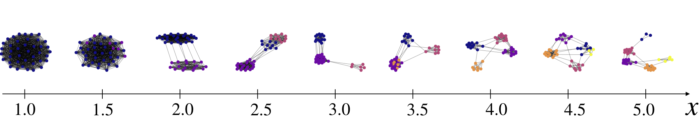

# Graph prediction with fused Gromov-Wasserstein

This repository contains a Python implementation of the supervised learning method proposed in [Brogat-Motte et al., 2022](#references) using PyTorch library and POT library (Python Optimal Transport).

This method aims at providing a general method for solving (labeled) graph prediction problems. It takes advantage of recent advances in computational optimal transport. It makes use of the FGW distance ([Vayer et al., 2020](#references)) which is a natural metric for graph comparison.
In particular, FGW distance allows to leverage a ground metric on the graphs's nodes. For example, depending on the task at hand, different distances between atoms can be used to defined the FGW distance over the molecular graphs space. A complete description of the method is provided in [Brogat-Motte et al., 2022](#references).

## Quick start code example

**Load a training dataset.** Load training data, namely couples (x, y) where y should be a couple (C, F) such that C is an adjacency matrices with size n x n for a graph with n nodes, and F is a matrix of size n x d containing the nodes's features which are vectors of dimension d. The dataset can be composed of graphs with various sizes. We provide in this repository a synthetic labeled graph prediction dataset.
```python
from build_dataset import create_data_train, create_data_test

n_tr = 50
X_tr, Y_tr = create_data_train(n_tr)
X_te, Y_te = create_data_test()
```

**Convert data to torch.**
```python
import torch

X_tr = np.array(X_tr)[:, None]
X_tr = torch.tensor(X_tr, dtype=torch.float32)
Y_tr = [[torch.tensor(y[0], dtype=torch.float32), torch.tensor(y[1], dtype=torch.float32)] for y in Y_tr]
X_te = np.array(X_te)[:, None]
X_te = torch.tensor(X_te, dtype=torch.float32)
Y_te = [[torch.tensor(y[0], dtype=torch.float32), torch.tensor(y[1], dtype=torch.float32)] for y in Y_te]
```

**Instantiate the graph prediction model.** Choose the number of graph templates which will be used in the model, and their size (number of nodes).
```python
from method import DeepFgwEstimator

n_templates = 8
clf = DeepFgwEstimator(n_templates=n_templates)
clf.nb_node_template = 5
```

**Choose the training parameters.**
```python
clf.n_epochs = 200
clf.lr = 0.01
clf.n_out = 40 # Size of the model outputs during training
clf.max_iter = 5 # FGW parameter
clf.alpha = 0.5 # FGW parameter
```

**Training.**
```python
loss_iter = clf.train(X_tr, Y_tr, dict_learning=True)
```

**Compute the test score.**
```python
mean_loss_te = 0
for i in range(len(X_te)):

    y_pred = clf.predict(X_te[i])
    loss_te = clf.loss(Y_te[i], y_pred)
    mean_loss_te += loss_te
print(f'FGW mean test loss {mean_loss_te / len(X_te)}')
```

You should obtain the following results.

```
Loading dataset
Converting data to torch
Instantiate graph prediction model
Start training
[...]
End training
Training time 757.8463470935822
Start test
End test
Test time 0.754443883895874
FGW mean test loss 0.1765202134847641
Plotting the true and learned map
Plotting the learned templates
```

Plotting the optimization of the objective w.r.t the number of epochs.

<p align="center">

</p>

You can plot the learned map (See in test.py how to do it)



and compare it to the true map.


Moreover, it is possible to plot the graph templates learned during the training step. We plot them in the simplex along with the learned weights function just below.

<p align="center">

</p>

## References

- Brogat-Motte, L., Flamary, R., Brouard, C., Rousu, J., d'Alché-Buc, F. Learning to Predict Graphs with Fused Gromov-Wasserstein Barycenters. arXiv preprint arXiv:??????, 2022.

- Vayer, T., Chapel, L., Flamary, R., Tavenard, R., and Courty, N. Optimal transport for structured data with application on graphs. In International Conference on Machine Learning (ICML), 2019.
